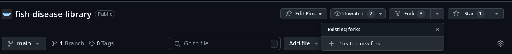
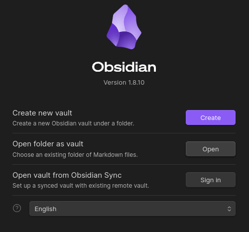
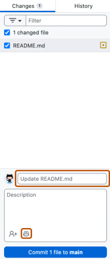
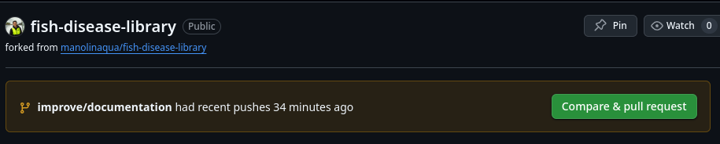
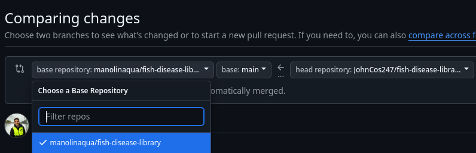

# Instructions for Contributing

The instructions here assume that you have already created a github account of your own. If you have not simply go to [github](https://github.com) and make an account.

## Pre-requisites

All downloads are free and don't require payment.

1. Download the [github desktop application](https://github.com/apps/desktop) (ideal if non technical)
	- For technical folks, you can of course utilize the Github CLI if that is more your preference.
2. Download [Obsidian](https://obsidian.md/download), a powerful note taking application which is used to structure and power the library.
    - We recommend using your computer for this and not the mobile version of the application.
    - While these files are `markdown` we utilize a number of features unique to Obsidian like tags, links and search that we are in the final application.
## Setting things up

#### Step 1: Fork the repository
- Navigate to the [fish-disease-libary](https://github.com/manolinaqua/fish-disease-library) repository in your browser and click the arrow next to *fork* to open the menu and select "*Create a new fork*".

#### Step 2: Clone the repository
- Clone your newly forked version of the repository onto your computer. 
	- You can find instructions on how to [clone your repository here](https://docs.github.com/en/repositories/creating-and-managing-repositories/cloning-a-repository).

#### Step 3: Open the repository in Obsidian
- When you open Obsidian you should see an option to **Open folder as vault**. Click it.

- When the file system explorer pops up navigate to the `/fish-disease-library` folder.
- **Important:** Before hitting Select make sure you have the `Fish Disease Libary` selected. So the final vault location should be `<your file system>/fish-disease-library/Fish Disease Library`
	- If this step is not followed then links will not update appropriate.

#### Step 4: Make edits and then "commit" your work

- Whenever you make updates or create a new file be sure to save the updates you made in Obsidian.
- To get your updates into **Github** you need perform a "commit". To do so add a short comment describing what you did and press the **commit file to branch** button.
	- Learn more about commits [here](https://docs.github.com/en/desktop/making-changes-in-a-branch/committing-and-reviewing-changes-to-your-project-in-github-desktop#write-a-commit-message-and-push-your-changes)

#### Create a pull request in github

- After you've made your edits, go to your github fork of the fish disease library on the github webpage. It is a link like the one below.
	- `https://github.com/<your user name>/fish-disease-library`
- You should see a message similar to this on the top of your repo.

- Click the green button and you should see a menu similar to below. Make sure that the **base repository: manolinaqua/fish-disease-library** is selected on the left drop down.

- Then simply add a brief title stating what you did and follow the template in the description.
- Once complete click the **Create pull request** button, sit back, and wait for someone to review it!

More information on Github's pull request process can be found here. [Example](https://docs.github.com/en/get-started/start-your-journey/hello-world)

